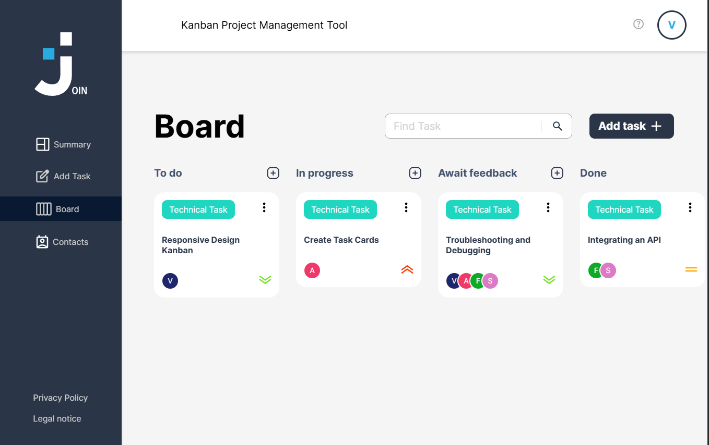

# Kanban Board Project

A responsive and interactive **Kanban Board** application built using `JavaScript`, `HTML`, `CSS`, and `Firebase Realtime Database`. This project is designed for managing tasks efficiently with features like task creation, editing, and categorization.

---

## 🤝 Collaboration
This project was developed in collaboration with:

- [Anna Fritz](https://github.com/Anna-Fritz)
- [Salmai Safi](https://github.com/Ghostsilent)
- [Fabian Roeseler](https://github.com/FabianRoeseler)

---

## ✨ Features
- **Task Management:**
  - Add, edit, and delete tasks.
  - Categorize tasks (e.g., To-Do, In Progress, Done).
- **User Authentication:** Login and signup system using Firebase Authentication.
- **Real-Time Updates:** Synchronize tasks across users and devices with Firebase Realtime Database.
- **Mobile-Friendly Design:** Fully responsive UI for mobile, tablet, and desktop devices.
- **Customizable:** Easy to extend and customize the codebase for additional features.

---

## 💻 Technologies Used

### Frontend:
- HTML5
- CSS3
- JavaScript (Vanilla JS)

### Backend:
- Firebase Realtime Database
- Firebase Authentication

---

## 📋 Usage

### 1. Login or Signup
Users need to log in or create an account to access their Kanban board.

### 2. Add Tasks
- Click on "Add Task" to create a new task.
- Assign categories and due dates.

### 3. Manage Tasks
- Drag and drop tasks between categories.
- Edit or delete tasks as needed.

### 4. Real-Time Collaboration
Any changes made are immediately reflected across devices.

---

## 🌐 Live Demo

- **Play the Game**: [Live Test](http://join.vadim-wart.com/)  
- **GitHub Repository**: [GitHub Link](https://github.com/VadimWart/join_app.git/)

---

## 🌟 Screenshots

### Login Screen

### Kanban Board

### Add Task

### Task Details

---
## 📧 Contact

If you have any questions or would like to connect, feel free to reach out to me:

- **Email**: [your.email@example.com](mailto:contact@vadim-wart.com)
- **LinkedIn**: [Your LinkedIn](https://www.linkedin.com/in/vadim-wart-a4564a32a)
- **GitHub**: [Your GitHub](https://github.com/VadimWart)

I'm always happy to discuss new opportunities, collaborations, or just connect with like-minded professionals! 😊

 
 

